# Unpriced

Reproducible estimates of what unpaid household work would cost at market prices, built entirely from free public data. The flagship module is childcare.

Satellite accounts usually value unpaid work by multiplying unpaid hours by today's market replacement price. That is transparent, it is standard, and this project produces exactly that benchmark. But replacement cost treats the observed price as though it could be applied unchanged to any volume of market substitution. It takes a marginal price and extrapolates it linearly into an inframarginal valuation. For childcare, where labor supply is constrained, capacity is regulated, and quality standards bind, that is a strong assumption and often an implausible one.

So this project produces two things. First, a marginal replacement-cost satellite account, which is the standard accounting benchmark done carefully. Second, and more ambitiously, a counterfactual marketization price: the price at which the childcare sector would need to clear if some share of unpaid care were actually shifted into the paid market at scale. The marketization price is scale-sensitive, elasticity-informed, and closer to the object that policymakers actually need when they ask about formalization, subsidization, or expanding care provision.

Replacement cost is useful for saying what unpaid care is worth if purchased one unit at a time at current prices. But policy does not operate one unit at a time. Real policy asks what happens when many households shift behavior together. At that point, prices, wages, and capacity matter. Replacement cost prices unpaid care as if markets were passive. Marketization price asks what happens when markets have to absorb it. One is a spot price. The other is a transition price.

The canonical childcare headline in this repo remains a short-run fixed-supply-shape benchmark: marketization shifts demand, so positive alpha raises price by construction. An additive dual-shift sensitivity layer is now available for pooled childcare as a parallel medium-run estimand. In that layer, marketization can also shift supply outward through entry and formalization or inward through cost pressure, so the sign of the price effect is no longer fixed.

Both products are demonstration-grade: honest about their limitations, transparent about their assumptions, and fully reproducible from public data. The public-facing demo is intended to show the current outputs alongside their caveats, not to hide them until they clear a publication-grade evidence bar.

## How to read this demo

- **Benchmark** asks what unpaid childcare is worth at today’s marginal replacement price.
- **Short-run canonical** asks what price clears if unpaid care enters the current paid market with fixed supply shape.
- **Medium-run sensitivity** asks what happens if marketization also expands paid-care capacity and raises provider costs.
- **Diagnostics / audit** ask how much support quality, fit stability, and decomposition quality readers should trust.

---

## National satellite account benchmark

Latest benchmark year: **2022**. This is a partial-equilibrium accounting identity. It values unpaid childcare at the current marginal replacement price, with no equilibrium adjustment for what would happen if that care actually entered the market.

```
value = marginal replacement price × unpaid child-equivalent quantity
```

The preferred benchmark uses the **direct-care-equivalent** replacement price, which isolates the labor component. The gross-market benchmark is retained as an upper bound, and the residual is shown explicitly rather than buried.

| Measure | Value | Unit |
|---------|-------|------|
| Preferred benchmark: direct-care value | $41.38B | annual national value |
| Gross-market upper benchmark | $50.35B | annual national value |
| Excluded non-direct residual | $8.97B | annual national value |
| Direct-care-equivalent price | $8,762 | per child-equivalent year |
| Gross market price | $10,660 | per child-equivalent year |
| Unpaid child-equivalent quantity | 4.72M | annual slots |
| Average unpaid childcare hours | 457.9 | per child-year |
| Price-support population share | 89.0% | of national under-5 population |

The annual satellite-account series is generated by `python -m unpriced.cli report`.

<details>
<summary><strong>How the price decomposition works</strong></summary>

The direct-care-equivalent price splits the gross market price into a labor component and a non-direct-care residual (facilities, administration, meals):

```
direct_care_price = (wage × fringe_multiplier × annual_hours) / children_per_worker
```

where `wage` is the observed or imputed childcare-worker hourly wage from QCEW, weighted by the state-year provider-type and age mix from ACS. The implied wage is back-solved: `wage = direct_care_price × children_per_worker / (fringe_multiplier × annual_hours)`. The raw labor-equivalent price is clipped at the gross market price — direct-care cannot exceed the total.

This is **not cost accounting** — it is a transparent assumption-based decomposition.

| Assumption | Value | Source | Note |
|-----------|-------|--------|------|
| Fringe multiplier | 1.3763 (`26.48 / 19.24`) | BLS ECEC Table 4, June 2025 | Compensation-to-wages benchmark for private-industry service occupations in health care and social assistance — not a childcare-specific estimate. |
| Annual hours | 2,080 (`52 × 40`) | BLS OEWS Technical Notes | FTE annualization convention, not a claim about realized worker hours. |
| Center staffing (children/worker) | 4 / 7 / 10 | ACF/NCECQA Brief #1, Table 4 (2014) | Most-common state licensing ratios (infant/toddler/preschool). Toddler is a midpoint of the brief's 18- and 35-month ratios. |
| Home staffing (children/worker) | 2 / 4 / 6 | Head Start 45 C.F.R. §1302.23 | Benchmark mapping — official sources distinguish family and group homes in ways the model does not. |
| Market hours/child/week | 18.24 | NCES ECPP 2019 + Digest 202.30 | `(12,594 / 21,195) × 30.7` — market-size proxy, not direct enrollment. |

All values are centralized in [`configs/assumptions.yaml`](configs/assumptions.yaml).

<details>
<summary>Source citations</summary>

1. **BLS ECEC** — U.S. Bureau of Labor Statistics, "Employer Costs for Employee Compensation," Table 4, June 2025. [bls.gov/news.release/ecec.t04.htm](https://www.bls.gov/news.release/ecec.t04.htm)
2. **BLS OEWS** — Occupational Employment and Wage Statistics Technical Notes. [bls.gov/oes/oes_ques.htm](https://www.bls.gov/oes/oes_ques.htm)
3. **ACF/NCECQA** — Research Brief #1, Table 4 (2014). [childcareta.acf.hhs.gov](https://childcareta.acf.hhs.gov/sites/default/files/new-occ/resource/files/center_licensing_trends_brief_2014.pdf)
4. **Head Start** — 45 C.F.R. §1302.23. [eclkc.ohs.acf.hhs.gov](https://eclkc.ohs.acf.hhs.gov/policy/45-cfr-chap-xiii/1302-23-family-child-care-option)
5. **NCES ECPP** — "Early Childhood Program Participation: 2019" (NCES 2020-075REV). [nces.ed.gov](https://nces.ed.gov/pubs2020/2020075REV.pdf)
6. **NCES Digest** — Table 202.30. [nces.ed.gov](https://nces.ed.gov/programs/digest/d22/tables/dt22_202.30.asp)

</details>

<details>
<summary>Sensitivity design</summary>

The decomposition sensitivity sweep applies a bounded ±10% stress envelope around the canonical values:

- Staffing scale: 0.90 / 1.00 / 1.10
- Fringe: 1.24 / 1.38 / 1.51

These are design constants for a bounded stress test, not alternative source estimates. They do not affect canonical outputs.

Direct-care price range: $5,371–$7,787. Implied wage range: $9.56–$9.75. The wage stability makes it a useful anchor even when the price-level decomposition is uncertain.

</details>

</details>

---

## Counterfactual marketization price demo

This is the headline research product. If some share of currently unpaid childcare entered the paid market, what price would the sector clear at?

There is no single answer. It depends on how much care gets outsourced, how supply and demand respond to price, and what the existing market looks like in each state and year. This project builds the machinery to answer that question under explicit, adjustable assumptions, then reports honestly how much the answer depends on those assumptions.

Canonical scenario outputs use `observed_core` and `household_parsimonious`: **556 scenario rows** across observed price-support years **2014–2022**. The separate real-mode demand-fit sample for `observed_core` is used only for the audit status below.

| Measure | Value | Unit |
|---------|-------|------|
| Gross market price | $8,218 | per child per year |
| Direct-care-equivalent price | $6,564 | per child per year |
| Displayed non-direct-care remainder | $1,654 | per child per year |
| Implied direct-care wage | $9.75 | per hour |
| Marketization price (alpha = 0.50) | $8,737 | per child per year |
| Marketization price (alpha = 1.00) | $9,125 | per child per year |
| Demand elasticity | -0.021 | at mean |
| Supply elasticity | 4.078 | weighted median |
| LOO state R² | -0.097 | held-out fit |
| LOO year R² | -0.000 | held-out fit |

Displayed non-direct-care remainders are the arithmetic remainder from displayed gross and direct-care medians so public decomposition displays read cleanly. The separate report artifacts still retain component medians.

**Status:** proof-of-concept headline. The selected `observed_core` run is economically admissible, and the latest checked-in real-mode audit accepted `78 / 100` bootstrap draws.

This is a **demonstration-grade sectoral counterfactual**, not a full-economy GE model. The small alpha-price response is driven mainly by the fitted elasticities: demand is very steep and supply is fairly elastic, so outsourcing shifts move mostly through quantity rather than price.

<details>
<summary><strong>What is alpha?</strong></summary>

Alpha is the outsourcing share — the fraction of currently-unpaid childcare hours hypothetically shifted into the paid market.

- **alpha = 0** is the status quo
- **alpha = 0.10** means 10% of unpaid hours enter the market
- **alpha = 0.50** means half
- **alpha = 1.00** means all unpaid childcare is outsourced

Higher alpha pushes more demand into the market, raising the equilibrium price. With the current elasticities (very elastic supply at 4.078, inelastic demand at -0.021), price increases are modest — the elastic supply curve means the market absorbs additional quantity mainly through expanded provision rather than higher prices.

</details>

---

## Evidence quality and decomposition layers

These are audit layers: observed support is reasonably strong through 2022, but the main fragilities are identification stability, out-of-sample fit, and support quality. They help readers interpret the canonical pooled headline; they do not replace it.

Beyond the pooled headline estimates, the project maintains an **evidence-quality layer** that tracks, for every component of the childcare pipeline, how much of the underlying data rests on direct administrative evidence versus inferred, proxy, or fallback sources. The project:

- Ingests real Child Care and Development Fund (CCDF) administrative data (163 state-year rows) and classifies each row by the quality of its public-vs-private childcare split — distinguishing explicit administrative records, inferred support, retained proxy support, and downgraded proxy support.
- Harmonizes state childcare licensing rules (4,692 harmonized rules) into a structured regulatory panel covering all 50 states and DC.
- Builds segmented childcare quantities that separate public-admin, subsidized-private, and unsubsidized-private channels alongside the pooled model.
- Exports machine-readable release artifacts that specify which outputs are headline-eligible, which are diagnostics-only, and what publication rules apply.

**Why this matters for economists and policy readers.** Replacement-cost and marketization-price estimates gain credibility when readers can verify how much of the underlying decomposition rests on direct administrative evidence. Policy readers evaluating formalization need to know which components are robust headline objects and which are still under empirical construction. The licensing and segmentation layers matter because formalization policy operates differently on public-admin care, subsidized-private care, and unsubsidized-private care — expanding public pre-K, increasing CCDF subsidy rates, and deregulating private providers are distinct policy levers that act on distinct segments of the market. The project is unusual in pairing a simple pooled headline with a transparent support-quality audit, rather than presenting a single number and hiding the empirical uncertainty behind it.

Of the 163 CCDF administrative state-year rows, **107** (explicit + inferred) are headline-eligible for decomposition claims; **56** (retained or downgraded proxy) are excluded from headline use. The licensing IV produces diagnostics-only outputs in its current form (weak first-stage, F = 1.24). Segmented outputs are additive scaffolding — they complement but do not replace the canonical pooled model. The core pipeline is rebuildable from source data with no manual steps; three optional inputs (CCDF policy workbooks, ICPSR licensing archives) enrich the release bundle but require manual download.

<details>
<summary><strong>CCDF decomposition and support quality</strong></summary>

The project ingests real CCDF administrative data from Administration for Children and Families (ACF) reports and classifies each of the 163 state-year rows by the quality of its public-vs-private childcare split:

| Support bucket | State-year rows | Share | Headline eligible? |
|---|---|---|---|
| Explicit administrative | 7 | 4.3% | Yes |
| Inferred from related fields | 100 | 61.3% | Yes |
| Retained proxy | 9 | 5.5% | No — diagnostics only |
| Downgraded proxy | 47 | 28.8% | No — diagnostics only |

**107 rows** (explicit + inferred) are eligible for headline-grade CCDF decomposition claims. **56 rows** (retained proxy + downgraded proxy) are excluded from headline use and retained only for diagnostics.

The 47 downgraded-proxy rows estimated the public/private split using subsidy payment-method shares (voucher, contract, or private-pay distributions) rather than direct administrative counts of children served. Because the payment-method distribution diverges substantially from children-served totals for these rows (mean ratio: 2.10×), they are downgraded to a simpler children-served fallback. The 9 retained-proxy rows have smaller gaps but still fall short of the explicit/inferred standard.

**Publication rule:** headline-grade CCDF decomposition claims should use only explicit and inferred support rows. Retained-proxy and downgraded-proxy rows should appear only in appendix or diagnostic contexts.

</details>

<details>
<summary><strong>Licensing harmonization and causal diagnostics</strong></summary>

State childcare licensing rules are harmonized from raw regulatory source documents into a structured panel: 4,692 harmonized rule rows from 16,338 raw audit rows, covering center-based, family home, and large group home provider types across all 50 states and DC. Rules cover staffing ratios, group sizes, background check requirements, and age-specific regulations.

This panel serves two purposes:
1. It provides a structured regulatory-variation layer for the segmented decomposition, where licensing stringency differs by provider type and state.
2. It supports a licensing-shock instrumental variable (IV) design for estimating causal supply responses to regulatory changes.

**Licensing IV status: diagnostics only.** The full-panel multi-state licensing IV produces weak first-stage results (F-statistic = 1.24 across 41 states, 5,013 county-year observations). Neither the provider-density nor employer-establishment-density outcome yields a headline-usable estimate. The recommended use tier is **diagnostics only**: the IV machinery exists, the data are harmonized, and the design is documented, but the results should not be cited as causal evidence in their current form.

The 4-state supply IV pilot documented in the model-mechanics section below uses a more concentrated identification strategy (3 treated states, F = 83.3). The full-panel version here scales that approach to all states with harmonized licensing data, at the cost of diluting the treatment signal across states where licensing variation is less concentrated. Both are retained — the pilot as a proof-of-concept, the full-panel version as a broader but weaker diagnostic.

CCDF policy coverage is available for copayment requirements (1,072 observed state-year rows, 99.2% coverage), but promotion of policy controls beyond copayment is intentionally conservative.

</details>

<details>
<summary><strong>Segmented childcare decomposition</strong></summary>

The segmented decomposition separates childcare quantities into three channels:

- **Public-admin care** — directly provided or administered through public programs (e.g., Head Start, state pre-K)
- **Subsidized-private care** — privately provided but publicly subsidized through CCDF vouchers or contracts
- **Unsubsidized-private care** — privately provided and privately paid

This decomposition matters because formalization policy affects each channel differently. Expanding public pre-K, increasing CCDF subsidy rates, and deregulating private providers are distinct interventions that operate on distinct segments of the childcare market. A pooled model treats them as one market; the segmented decomposition allows analysis of how outsourcing scenarios play out differently across channels.

**These outputs are additive only.** They do not replace the canonical pooled estimates. They provide additional structured detail — 139 segmented state-year rows — that can be used for scenario decomposition and policy analysis alongside the pooled benchmark. The segmented results are not presented as canonical model outputs because the segment-level data support (particularly the CCDF public/private split) is still mixed quality, as documented in the support-quality section above.

</details>

<details>
<summary><strong>Release bundle and reproducibility contract</strong></summary>

The release package is a self-contained bundle with a machine-readable contract specifying which artifacts are headline-safe, which are diagnostics-only, and what publication rules apply. This matters for any downstream visualization or publication workflow: the contract tells consumers exactly which outputs can support headline claims and which should appear only in appendix or diagnostic contexts.

The release is fully rebuildable from source data (see Quickstart below). The core pipeline requires zero manual actions. Three optional inputs enrich the release bundle but require manual download: CCDF policy workbooks from ACF and ICPSR Child Care Licensing Study archives (ICPSR 37700, 38539). Without these, the pipeline produces the full pooled analysis and diagnostics; with them, it adds richer licensing harmonization and policy-control detail. The machine-readable `manual_requirements` output documents exactly which files are needed and where to obtain them.

Key contract rules:
- Only explicit and inferred CCDF support rows are headline-eligible for decomposition claims.
- Licensing IV outputs are diagnostics-only in their current form.
- Segmented outputs are additive-only and should not be presented as the canonical marketization result.

</details>

---

## How the model works

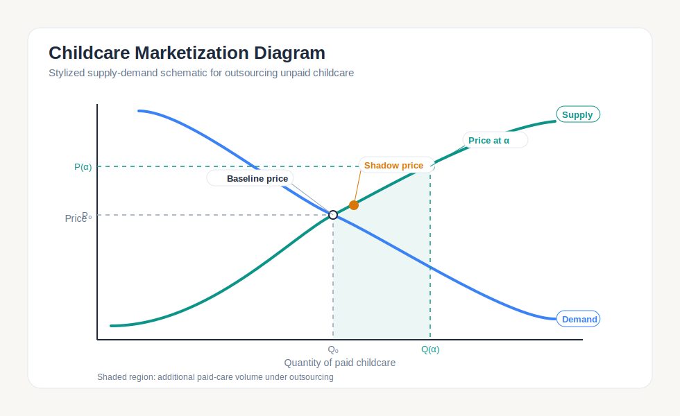

The observed market price (**P₀**) is where current paid supply meets current paid demand. When a share **alpha** of unpaid childcare hours enters the paid market, demand shifts right. The solver finds the new equilibrium price **P(α)** using estimated supply and demand elasticities. The shaded region shows the additional volume of paid care under outsourcing.

**How each component is estimated:**

- **Baseline price P₀** — the state-year median of county-level annual childcare prices from the National Database of Childcare Prices (NDCP), covering center-based and family-based care.
- **Baseline quantity Q₀** — a state-year market-quantity proxy, currently constructed from under-5 population scaled by a configured weekly-hours assumption. This is not a direct estimate of paid-care enrollment or utilization.
- **Unpaid quantity** — hours of unpaid childcare per state-year from the American Time Use Survey (ATUS), converted to full-time-equivalent childcare slots.
- **Demand elasticity (-0.021)** — estimated via two-stage least squares at the state-year level using `outside_option_wage` as the current canonical instrument, with parent employment rate and single-parent share as controls. A births-based IV sensitivity was tested on the same observed-core sample, but it produced a positive elasticity (`+0.150`), weak first-stage fit (`R² = 0.148`), and much worse leave-one-state-out performance, so it is quarantined rather than used in the headline pipeline. The canonical signed elasticity remains negative: higher prices reduce quantity demanded.
- **Supply elasticity (4.078)** — the employment-weighted median of county-level log-log slopes of provider density on annual price within each state-year cell. This is a reduced-form price-quantity gradient, not a structural supply function. A multi-state licensing-shock IV demo is documented below but is not used in the canonical estimates.

### Solver mechanics and supply curve extensions

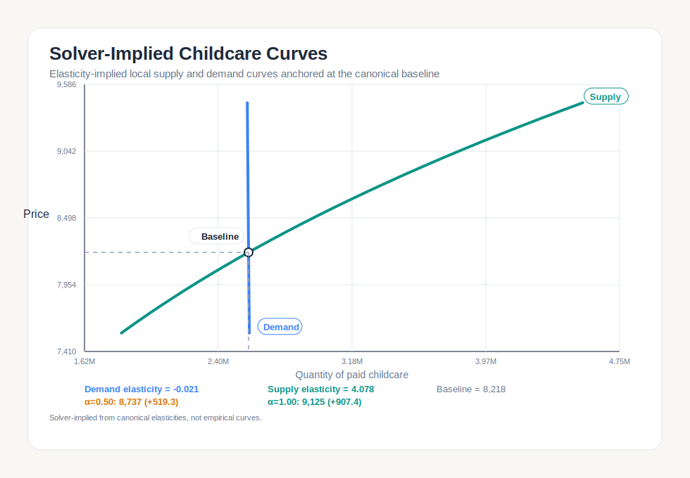

The solver constructs constant-elasticity curves through the observed baseline:

```
Demand:  Qd(P) = Q₀ × (P / P₀)^(-|εd|)     εd = -0.021
Supply:  Qs(P) = Q₀ × (P / P₀)^(εs)          εs = 4.078
```

Both curves pass through the baseline point (Q₀, P₀) by construction. The demand curve is very steep (highly inelastic) and supply is flatter (highly elastic), so outsourcing demand shifts are absorbed mainly through quantity increases with modest price effects. At α = 0.50 the price rises ~$519; at α = 1.00, ~$907. These are **solver-implied curves from the canonical elasticities**, not nonparametric empirical schedules.

The canonical short-run solver finds each marketization price by bisection: for a given α, it solves `Qd(P) + α × U₀ = Qs(P)` where U₀ is the unpaid quantity proxy. That is a demand-only marketization shift, so price rises mechanically once `α > 0`.

### Medium-run sensitivity: dual-shift marketization

An additive pooled-only dual-shift sensitivity command, `simulate-childcare-dual-shift`, keeps the same demand block but lets marketization also move supply:

```
Qd(P, α) = Q₀ × (P / P₀)^(-|εd|) + α × U₀
Qs(P, α) = Q₀ × exp(kappa_q × α) × (P / (P₀ × exp(kappa_c × α)))^(εs)
```

`kappa_q` is an outward supply shifter from entry / formalization / capacity expansion. `kappa_c` is an upward cost shifter from wages / regulation / Baumol-type pressure. This medium-run layer is sensitivity-only in v1: it does not replace the canonical pooled headline, but it does publish the frontier where marketization prices switch from rising to falling.

A more interpretable way to read the knobs is at the chosen headline alpha itself. At `α = 0.50`, the current `kappa_q` grid (`0.00` through `1.50`) corresponds to roughly `0%`, `13%`, `28%`, `45%`, `65%`, `87%`, and `112%` extra supply expansion. The current `kappa_c` grid (`0.00` through `0.20`) corresponds to roughly `0%`, `3%`, `5%`, `8%`, and `11%` extra cost pressure. That is usually easier to interpret than the raw kappa values themselves.

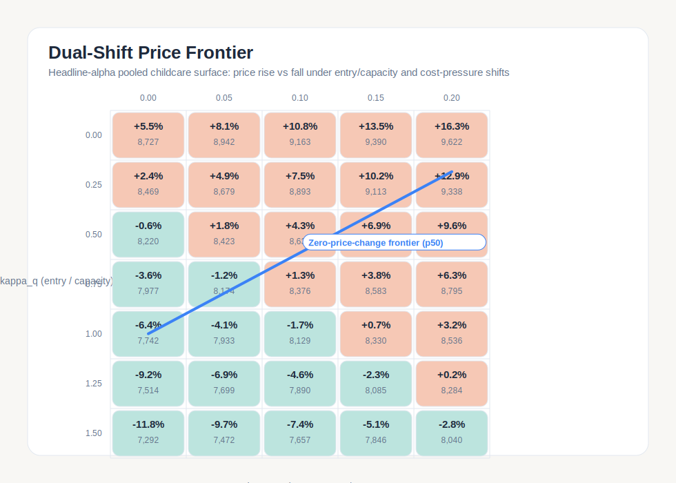

In the current sample-mode default grid at headline `α = 0.50`, median price changes range from about `-11.8%` (`kappa_q = 1.50`, `kappa_c = 0.00`) to `+16.3%` (`kappa_q = 0.00`, `kappa_c = 0.20`). A childcare-specific reading is: if moving half of unpaid care into the market increases paid childcare capacity by about `45%` while raising provider costs by about `5%`, the model implies only about a `+1.3%` median price change. The median zero-price frontier is around `kappa_q* = 0.50` when `kappa_c = 0.00`, rising to about `0.91` when `kappa_c = 0.10`.

At `α = 0.50`, keeping price roughly flat requires about `28%` extra paid-care capacity if provider cost pressure is about `0%`, about `58%` if cost pressure is about `5%`, and about `93%` if cost pressure is about `11%`.

### Optional method sensitivity: piecewise supply

---

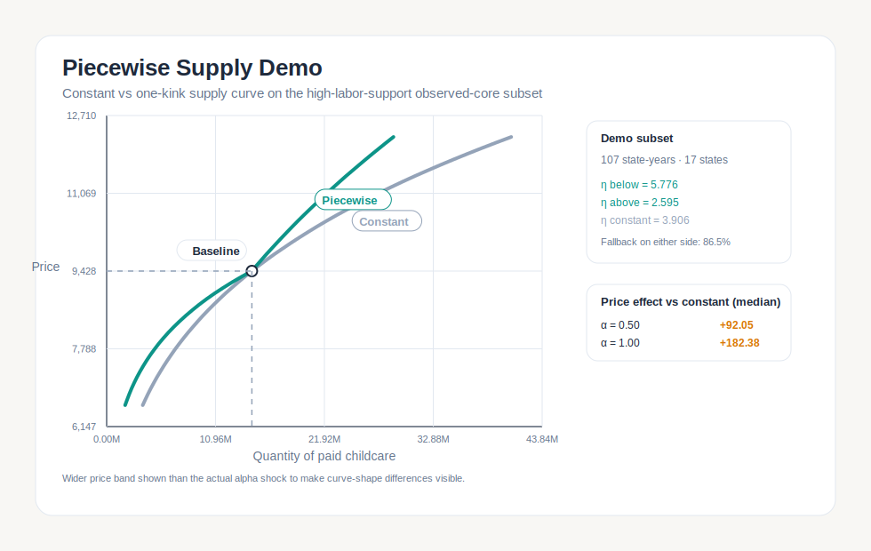

The constant-elasticity assumption can be relaxed. This piecewise-supply demo estimates separate reduced-form county price-density slopes **below** and **above** the observed baseline state price, then solves the same outsourcing counterfactual with a one-kink local supply curve:

```
Qs(P) = Q₀ × (P / P₀)^(η_below)    for P ≤ P₀
Qs(P) = Q₀ × (P / P₀)^(η_above)    for P > P₀
```

Both branches equal Q₀ at P = P₀, so the curve is continuous with a kink. In the current data, η_below (5.96) is larger than η_above (2.60), meaning supply responds less elastically above the baseline than below it. This slightly raises predicted marketization prices relative to the constant benchmark (median effect: +$291 at α = 0.50, +$565 at α = 1.00) because the stiffer above-baseline supply requires more price increase to provide additional slots.

**Key caveat:** Only 22 of 107 eligible state-years have directly estimated positive slopes on both sides. Most rows borrow a pooled fallback on at least one side (79.4%). This is a methodology demonstration, not a richly estimated state-by-state piecewise supply system.

### Supply IV pilot: licensing-shock identification

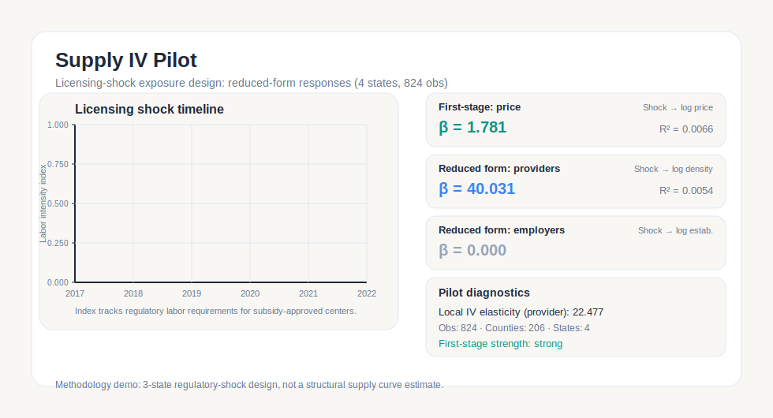

The canonical supply elasticity has no instrument — it is a price-quantity gradient, not a causal estimate. This demo asks: can real changes in childcare regulations identify how supply responds to price?

The idea is simple. When a state tightens staffing or group-size rules for childcare centers, it raises the cost of providing care. Counties with more center-based providers are hit harder than counties with fewer. That differential exposure creates a natural experiment: compare price and provider-density changes in more-exposed vs. less-exposed counties within the same state and year.

The current shock panel uses three real licensing reforms — Virginia's 2018 group-size caps, Montana's 2018 group-size guidance, and Louisiana's post-2017 group-size requirements. South Carolina stays in the panel as control/overlap support (its ratio changes produce no shock variation in the index). Results across 4 states (206 counties, 824 rows, 2017–2022):

- Tighter regulation **raises prices** (first-stage β = 1.78, F = 83.3)
- More providers per capita appear in response (reduced-form β = 40.03), yielding a local IV supply elasticity of 22.48
- No effect on the number of employer establishments — the shock affects how intensively existing providers operate, not whether new ones enter

**This is a methodology demo, not a national supply-IV estimate.** It shows that licensing-shock data can be sourced, normalized, and run through a standard exposure design. The result rests on 3 treated states with 4 state clusters — stronger than a single-state pilot, but still not enough for robust generalization.

---

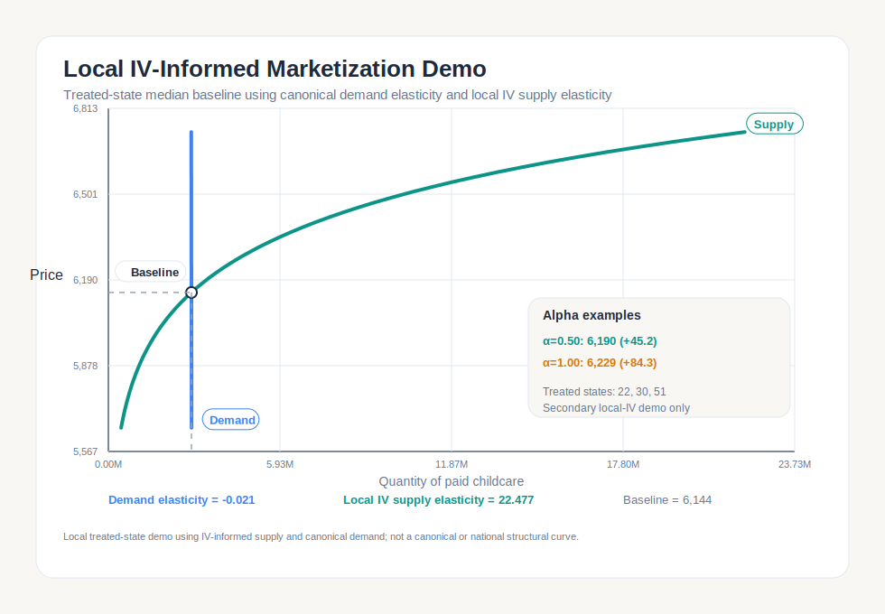

What would the outsourcing counterfactual look like if we used the local IV supply elasticity instead of the canonical reduced-form estimate? The chart above pairs the canonical demand elasticity (-0.021) with the local IV supply elasticity (22.48), anchored on the treated-state median baseline price ($6,144). Because the IV supply is far more elastic than the canonical (22.48 vs 4.08), the market absorbs outsourced demand almost entirely through quantity expansion — price effects are minimal (+$45 at α = 0.50, +$84 at α = 1.00). This is a **non-canonical demo** showing sensitivity to the supply estimate, not a replacement for the headline results.

## Price concepts

<details>
<summary><strong>Price concept definitions</strong> (the project produces several related but distinct price estimates)</summary>

**Gross market price** — the observed annual price of center-based or family-based childcare in a state-year cell from NDCP county data aggregated to the state. This is the **canonical price series**. All other concepts are derived from or compared against it.

**Direct-care-equivalent price** — the labor component of the gross price, computed from observed wages, source-backed staffing ratios, and a BLS compensation benchmark. Clipped at the gross price. See the [decomposition details](#national-satellite-account-benchmark) above for the formula and assumption values.

**Implied direct-care wage** — the hourly wage back-solved from the direct-care-equivalent price. More stable than the price split (sensitivity range: $9.56–$9.75) because it is anchored to observed QCEW wage data.

**Benchmark replacement cost / satellite account** — what it would cost to value unpaid childcare at a current marginal replacement price, ignoring how prices would change if millions of families entered the market. Pure accounting, no equilibrium adjustment.

**Marginal shadow price** — the equilibrium price from outsourcing one additional increment of unpaid care. Computed by the same solver at an infinitesimal alpha. Typically very close to the baseline gross price.

**Marketization price** — the equilibrium price when a share alpha of unpaid hours enters the paid market. Reported with bootstrap 10th-to-90th percentile uncertainty intervals over the demand and supply elasticities.

</details>

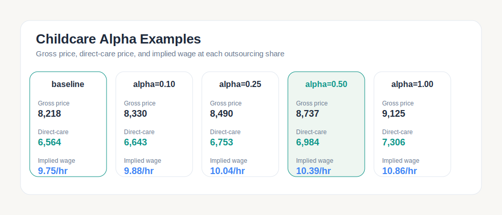

Each card shows three price layers at a given alpha. **Gross price** is the solver-implied equilibrium. **Direct-care** is the labor-equivalent component of that gross price, computed with the formula above using the equilibrium wage at that alpha. **Implied wage** is the back-solved hourly rate. The baseline card (alpha = 0) shows the observed market values; subsequent cards show how each layer responds to outsourcing.

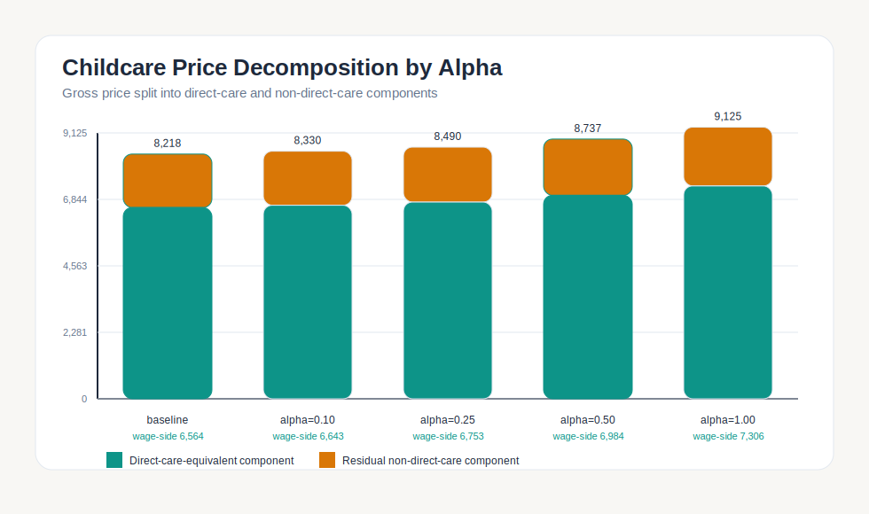

Stacked bars show the displayed gross price split into direct-care (teal) and a displayed non-direct-care remainder (amber) at each alpha. The amber segment is the arithmetic remainder from the displayed gross and direct-care medians so the stacked bars close cleanly. The wage-side labels below each bar report the direct-care component in dollars.

## Data and sample

Observed support is reasonably strong through 2022. This section audits the headline by showing where identification stability and out-of-sample fit remain fragile.

All inputs are free public data. The pipeline joins six sources into county-year and state-year panels.

<details>
<summary><strong>Source details and coverage</strong></summary>

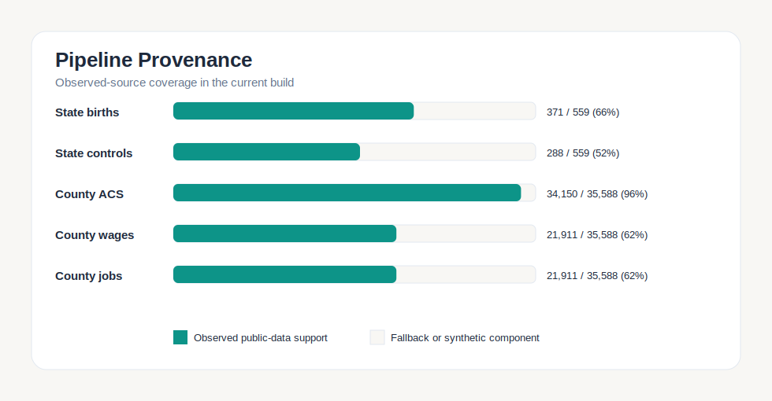

The pipeline assembles county-year and state-year panels from six public sources. Green bars show observed-data coverage; beige shows synthetic fallbacks. **State births** (66%) come from CDC WONDER natality data and are retained as demographic / diagnostic inputs, including a quarantined demand-IV sensitivity. **State controls** (55%) are ACS demographic variables at the state level. **County ACS** (96%) provides household demographics. **County wages** and **county jobs** (~65% each) come from QCEW; the remaining ~35% are imputed from price-derived fallbacks for counties without QCEW childcare-sector data.

| Source | Provides | Geography | Years |
|--------|----------|-----------|-------|
| NDCP | County-year childcare prices | ~1,200 counties | 2008-2022 |
| ATUS | Unpaid childcare hours | State-year | 2003-2024 |
| ACS | Demographics, household structure | County and state | 2009-2023 |
| QCEW | Childcare wages and employment | County and state | 2014-2024 |
| CDC WONDER | Birth counts (state-year demographics; quarantined demand-IV sensitivity) | State-year | varies |
| ACF/CCDF | Subsidy admin data, licensing rules | State-year | 2017-2020 |
| State licensing agencies | Licensing shock panel (supply IV demo) | County (VA, MT, LA, SC) | 2017-2022 |
| SIPP, CE | Validation benchmarks | National | 2020-2024 |

</details>

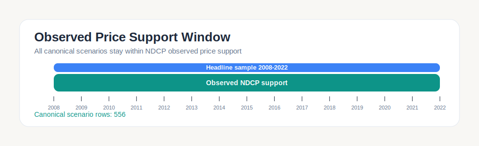

All canonical scenario rows stay within the NDCP observed-price window (2008–2022). The headline sample uses 2014–2022 only. No post-2022 nowcasts are included.

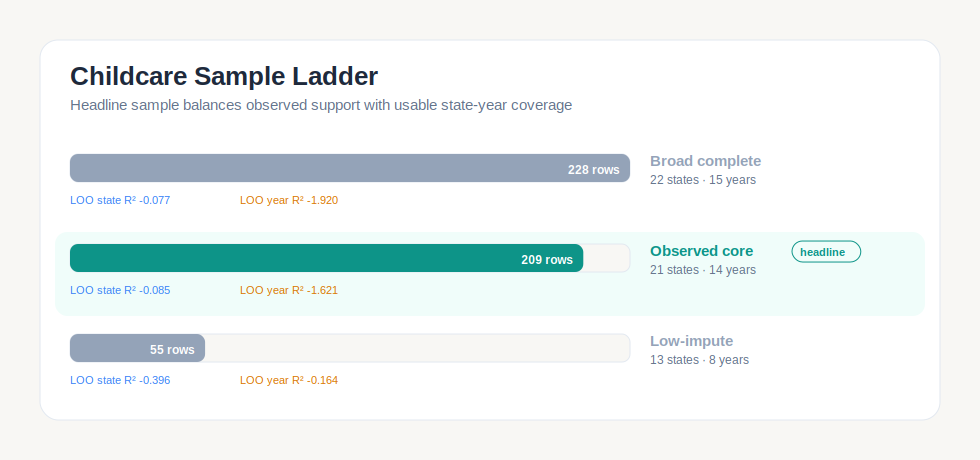

Three samples are tested. The **observed core** (green) is the headline: 139 state-year rows, 21 states, restricted to years with observed NDCP prices and QCEW labor coverage above 94%. The broader and stricter samples are retained as comparison/sensitivity results.

**LOO state R²** and **LOO year R²** are leave-one-out cross-validation diagnostics: each state (or year) is held out in turn, the model is re-estimated on the remainder, and R² is computed on the held-out predictions. Negative values mean the model predicts worse than a simple mean when any state or year is removed. This confirms the build is **demonstration-grade**.

## Scenario results

How much does the marketization price rise as the outsourcing share grows?

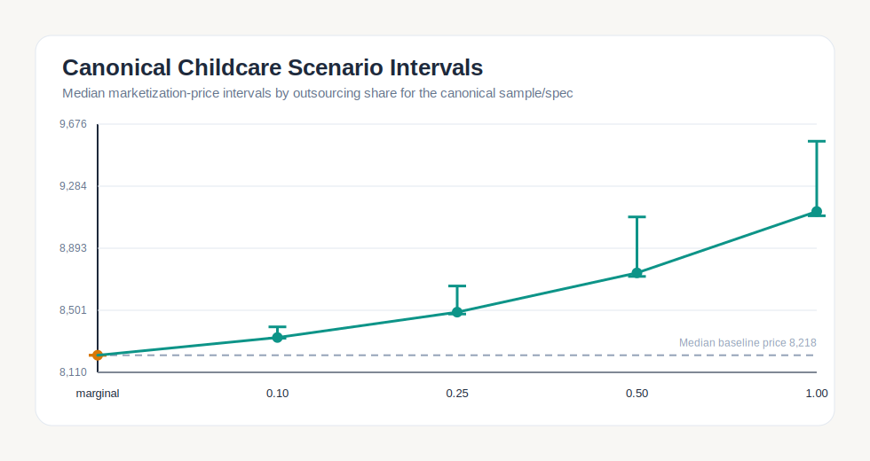

Each point is the median marketization price across canonical scenario rows at a given alpha. Vertical bars are bootstrap 10th-to-90th percentile intervals from resampling the demand and supply elasticities. The **marginal** point (amber) is the shadow price at an infinitesimal outsourcing increment. Intervals widen as alpha grows because larger demand shifts amplify elasticity uncertainty. At α = 1.00, the median price rises ~11% from the baseline.

### Specification comparison

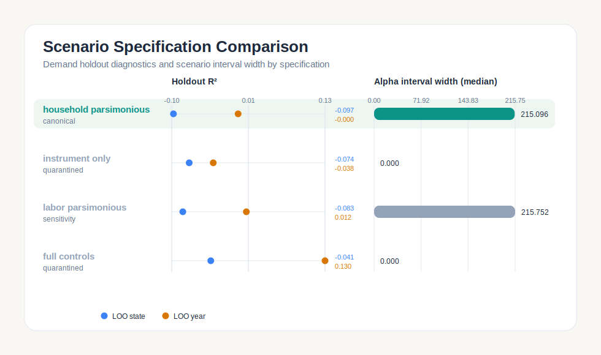

Four demand specifications are compared. The left panel shows holdout R² (leave-one-out by state in blue, by year in amber). The right panel shows the median alpha-interval width — how much the marketization price varies across the alpha range. All four checked-in specifications use the same current instrument, `outside_option_wage`, while varying the control set. The canonical **household parsimonious** specification uses parent employment rate and single-parent share as controls. **Labor parsimonious** adds unemployment. **Instrument only** (no controls beyond the wage IV) and **full controls** (adding median income) are quarantined because they produce positive demand elasticities — economically inadmissible. A separate births-based IV sensitivity was tested and also quarantined because it produced a positive elasticity (`+0.150`) with weak first-stage fit.

| Specification | Elasticity | LOO state R² | LOO year R² | Status |
|--------------|-----------|----------------|---------------|--------|
| household_parsimonious | -0.021 | -0.097 | -0.000 | canonical |
| instrument_only | +0.007 | -0.074 | -0.038 | quarantined |
| labor_parsimonious | -0.020 | -0.083 | +0.012 | sensitivity |
| full_controls | +0.797 | -0.041 | +0.130 | quarantined |

<details>
<summary><strong>Price decomposition sensitivity</strong></summary>

The direct-care price split depends on staffing-ratio and fringe assumptions. A 3×3 sensitivity sweep applies a bounded +/-10% stress envelope around the source-backed canonical staffing table and fringe multiplier:

- Direct-care price range: $5,371 to $7,787
- Implied wage range: $9.56 to $9.75

The wage stability makes it a useful anchor even when the price-level decomposition is uncertain.

</details>

## Limitations

Interpretation boundaries for the demo.

**The satellite account is still partial-equilibrium.** Even the preferred direct-care benchmark is an accounting construct, not a GE valuation. It says what unpaid childcare would be worth at a current marginal replacement price, not what would happen if all unpaid childcare actually moved into the paid market. That is precisely the gap the marketization metric is designed to address, but the marketization estimate itself is demonstration-grade.

**Causal identification is weak.** The current canonical demand elasticity uses an outside-option-wage IV rather than a strong quasi-experimental design, and the out-of-sample diagnostics remain weak. A births-based IV sensitivity was tested but is not used because it becomes economically inadmissible in the current observed-core sample. The negative leave-one-out diagnostics confirm the demand side does not generalize well out of sample. The canonical supply elasticity has no instrument — a multi-state licensing-shock demo exists but does not feed into the canonical estimates. This is the primary limitation.

**Geography mismatch.** Prices are observed at the county level (NDCP), but the causal core is estimated at the state level (ATUS). County-to-state aggregation loses real variation.

**Constant-elasticity assumption.** The solver assumes log-linear supply and demand. Real markets have kinks, capacity constraints, and regime changes. The piecewise supply demo shows how this can be partially relaxed, but that extension is itself limited by data support.

**Price decomposition is benchmark-driven.** The direct-care / non-direct-care split depends on source-backed staffing and compensation benchmarks plus a clipped decomposition rule; it is not literal cost accounting estimated from repo data. The preferred benchmark nets out the residual jointly, but does not separately identify markup, transport, administration, advertising, or profits.

**Temporal coverage.** NDCP prices end in 2022. The project does not extrapolate.

**Coverage is not full national price support.** The 2022 national benchmark uses price support for about 89% of the national under-5 population. That is strong enough for a benchmark, but still not full coverage.

**Sample size.** 139 state-year rows is sufficient for demonstration, not robust inference.

**No behavioral response.** Scenarios assume families and providers respond only through price — no quality changes, informal-care substitution, parental labor-supply responses, or policy feedback.

**Evidence-quality caveats.** The CCDF public/private decomposition relies on mixed-quality administrative support: 107 of 163 state-year rows are headline-eligible (explicit or inferred); 56 use retained or downgraded proxy evidence and are excluded from headline claims. The full-panel multi-state licensing IV is diagnostics-only (F = 1.24) and should not be confused with the sharper 4-state pilot (F = 83.3) documented above. Segmented childcare outputs are additive scaffolding that complements but does not replace the canonical pooled model. See the [evidence-quality section](#evidence-quality-and-decomposition-layers) for details.

<details>
<summary><strong>What the numbers do not mean</strong></summary>

- The gross market price is not "what it costs to raise a child." It is the annual price of a childcare slot.
- The direct-care-equivalent price is not a verified cost-accounting split.
- The marketization prices are not forecasts of what would happen if policy changed.
- The demand elasticity is not a strong causal estimate in this project.

</details>

## Assumptions

The demand and supply elasticities are estimated from repo data. The direct-care price decomposition uses a small number of source-backed assumptions documented in the [decomposition details](#national-satellite-account-benchmark) above. All values are centralized in [`configs/assumptions.yaml`](configs/assumptions.yaml).

<details>
<summary><strong>Fallback series (observed-data-derived)</strong></summary>

Three quantities use observed-data-derived fallback rules when direct coverage is incomplete:

- **Outside-option wage** — OEWS-derived state-year ratios where available; synthetic ratio fallback otherwise. OEWS overrides cover a minority of county rows; broader multi-year OEWS coverage is the primary upgrade path.
- **County employment** — QCEW/ACS employment-per-under-5 medians fill missing county employment counts.
- **Head Start capacity** — Observed slot-share medians fill missing Head Start slot counts.

These are derived from observed public data, not fixed scalars. They are documented in the audit artifact with status `derived_from_observed_public_data`.

</details>

## Quickstart

```bash
# run tests
PYTHONPYCACHEPREFIX=/tmp python -B -m pytest -q -p no:cacheprovider

# with your project environment active, rebuild the childcare pipeline end to end
PYTHONPYCACHEPREFIX=/tmp python -m unpriced.cli build-childcare --real
PYTHONPYCACHEPREFIX=/tmp python -m unpriced.cli fit-childcare
PYTHONPYCACHEPREFIX=/tmp python -m unpriced.cli simulate-childcare
PYTHONPYCACHEPREFIX=/tmp python -m unpriced.cli simulate-childcare-dual-shift
PYTHONPYCACHEPREFIX=/tmp python -m unpriced.cli report
```

<details>
<summary><strong>Extended pipeline rebuild</strong></summary>

After the pooled pipeline above, the evidence-quality and segmented layers can be rebuilt end-to-end:

```bash
PYTHONPYCACHEPREFIX=/tmp python -m unpriced.cli pull-ccdf --real --refresh
PYTHONPYCACHEPREFIX=/tmp python -m unpriced.cli build-ccdf-state-year --real --refresh
PYTHONPYCACHEPREFIX=/tmp python -m unpriced.cli build-childcare-segmented-report --real --refresh
PYTHONPYCACHEPREFIX=/tmp python -m unpriced.cli build-licensing-harmonization --real --refresh
PYTHONPYCACHEPREFIX=/tmp python -m unpriced.cli build-licensing-iv --real --refresh
PYTHONPYCACHEPREFIX=/tmp python -m unpriced.cli build-childcare-release-backend --real --refresh
```

All inputs are real administrative and survey data. The core pipeline requires zero manual actions. The release backend optionally consumes manually downloaded CCDF policy workbooks and ICPSR licensing-study archives for richer policy controls and licensing harmonization; see `outputs/reports/childcare_backend_release_manual_requirements.json` for the exact file list. The final command produces the release bundle with all artifacts, the handoff contract, and the headline summary.

</details>

<details>
<summary><strong>Repo layout</strong></summary>

```
configs/          project and sector configs
data/raw/         downloaded public source files
data/interim/     normalized parquet outputs
data/processed/   joined panels and model-ready datasets
src/unpriced/   package code
tests/            smoke and unit tests
outputs/reports/  JSON and markdown reports
outputs/tables/   CSV artifacts (support quality, licensing IV, release summaries)
outputs/figures/  SVG figures
```

</details>

<details>
<summary><strong>Data policy</strong></summary>

- Raw source files are immutable after download
- Normalized outputs are written to Parquet
- Secrets belong in `.env`, never in code or git history
- Survey-design metadata and imputation flags are carried through as first-class fields

</details>

<details>
<summary><strong>Tracked assets</strong></summary>

**Childcare figures:**
- [childcare_marketization_diagram.svg](outputs/figures/childcare_marketization_diagram.svg)
- [childcare_solver_implied_curves.svg](outputs/figures/childcare_solver_implied_curves.svg)
- [childcare_alpha_intervals.svg](outputs/figures/childcare_alpha_intervals.svg)
- [childcare_price_decomposition_by_alpha.svg](outputs/figures/childcare_price_decomposition_by_alpha.svg)
- [childcare_sample_ladder.svg](outputs/figures/childcare_sample_ladder.svg)

Generated report JSON/CSV/Markdown outputs are produced locally by `python -m unpriced.cli report` and are not linked from the public README.

</details>

## Home maintenance (preview)

A secondary module estimates the cost of outsourcing unpaid home-maintenance labor using AHS housing survey data, NOAA weather-exposure controls, and the same ATUS time-use framework. The pipeline builds a CBSA-wave panel of outsourced home-maintenance prices, fits a DIY-vs-outsourced switching model, and reports the switching-cost estimate.

```bash
make build-home
make fit-home
```

This module is functional but not yet featured in the headline outputs. See `configs/home_maintenance.yaml` for sector configuration and `tests/test_home_maintenance_panel.py` for test coverage.

## Status

Current public-facing scope: childcare and home maintenance (preview). Demonstration-grade, not publication-grade.

The pooled childcare benchmark and short-run marketization demo are the canonical headline products. The pooled dual-shift marketization surface is now available as an additive medium-run sensitivity estimand: useful for showing when price could rise or fall, but not a replacement for the canonical short-run headline. The evidence-quality layer — CCDF support tracking, licensing harmonization, segmented quantities, and the release contract — is complete and fully rebuildable. Licensing IV outputs and segmented scenarios are not headline-grade and are documented as diagnostics-only and additive-only, respectively.

Important boundary: NDCP observed prices end in 2022. All canonical scenarios stay within observed support. Any future post-2022 extension must be labeled as a nowcast.
